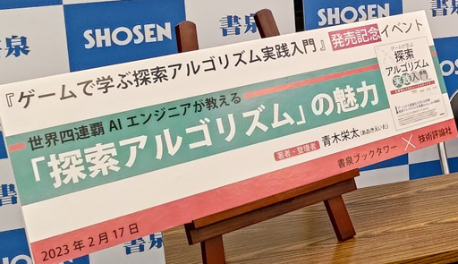
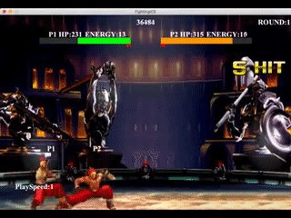

# Eita Aoki / Thunder
Optimization / Game AI Engineer

---
id: writing
## 執筆歴

### ゲームで学ぶ探索アルゴリズム実践入門～木探索とメタヒューリスティクス
[https://gihyo.jp/book/2023/978-4-297-13360-3](https://gihyo.jp/book/2023/978-4-297-13360-3)
{type=special}
技術評論社
ゲームを題材に、探索アルゴリズムの重要性と魅力を楽しく学ぶための入門書

### AHC典型解法シリーズ
[https://qiita.com/thun-c/items/8e7ae0249f1907854763](https://qiita.com/thun-c/items/8e7ae0249f1907854763)

Qiita
AtCoderのヒューリスティックコンテストで頻出の解法について、具体例とサンプルコードをつけて課題を解く過程を説明

### 世界四連覇AIエンジニアがゼロから教えるゲーム木探索入門
[https://qiita.com/thun-c/items/058743a25c37c87b8aa4](https://qiita.com/thun-c/items/058743a25c37c87b8aa4)

Qiita
ゲームで学ぶ探索アルゴリズム実践入門の前身となった記事

---
id: speaking
## 講演登壇歴

### TOYOTA AHC 至高のアルゴリズム解説会
https://atcoder.jp/contests/TOYOTA_AHCSupremeAlgorithmExplanatoryMeeting
{type=special}
トヨタ自動車株式会社 / 2024
トヨタ自動車が過去に開催したヒューリスティックコンテストの優勝解法を超える解法を解説

### 株式会社Spakona 技術顧問
株式会社Spakona / 2025~
週に1回、Spakona社の役員の方々向けに行っている勉強会
探索アルゴリズムの基礎から応用例まで、質疑応答を中心として解説

### 格闘ゲームを例としたAI開発へのアプローチ【オンラインセミナー】 豆寄席（まめよせ）
https://mamezou.connpass.com/event/185864/

株式会社豆蔵 / 2020
ゲームで学ぶ探索アルゴリズム実践入門の前身となった記事

### 世界四連覇AIエンジニアが教える「探索アルゴリズム」の魅力
https://speakerdeck.com/thunderc/shi-jie-si-lian-ba-aienziniagajiao-eru-tan-suo-arugorizumu-nomei-li

書泉ブックタワー / 2023
著書『ゲームで学ぶ 探索アルゴリズム実践入門』の執筆秘話の紹介と先行販売、サイン会

---
id: awards
## プログラミングコンテスト受賞歴

### ハル研プロコン2014 準優勝
{type=special}
ハル研究所が主催するコンテスト。ランダムな妨害要素のあるレースゲームのAIを開発する。Topcoder Open FINALISTやCODE VS優勝者といった非常に優秀なエンジニアが複数参加していた。
操作の自由度が高い中、将来を考慮した枝刈りをし、良い操作だけを考慮できる工夫をした。

### Fighting Game AI Competition 2016~2019 四年連続優勝
{type=special}
IEEE Conference on Games で開催された、格闘ゲームAIを開発するコンテスト
入力情報の遅延や1/60秒という短い計算時間の中、専用の順序で探索するアルゴリズムを考案し、ルール変更にも柔軟に対応した。

### AI Snakes Competition 2020 優勝

スネークゲームを二人対戦用に改変したゲームのAIを開発し、勝敗を競う。
同時着手ゲームで扱いづらいAlphaBeta法の探索順序と評価関数を工夫することで同時着手ゲームに適用し、ビット演算により高速化した。

### ColorShapeLinks AI competition 2020 Base Track 優勝

コネクトフォーに色と形の概念を加えたゲームのAIを開発し、勝敗を競う。
従来のコネクトフォーのビット演算を応用し、高速なMCTSを行った。

### DareFightingICE: AI Track 2022~2024 三年連続優勝

前述のFighting Game AI Competitionが名前とルールを一新し、2022年に始まったコンテスト
ゲーム内のフレーム情報や視覚情報が一切与えられず、ステレオの音情報のみを入力とする格闘ゲームのAIを開発し、勝敗を競う。
各技を発動した際の後隙を利用することで、狙ったタイミングで条件分岐する手法を考案した。

### Geometry Friends Competition: Circle Track 2023 優勝

物理演算を持ちいた、物体をゴールに運ぶゲームのAIを開発し、時間を競う。
盤面をグリッド上に離散化し、探索空間を狭める工夫をした。

### VGC AI Competition : Championship Track 2024 優勝

複数のモンスターを選んでパーティーを組み、各モンスター4つの技を用いたターン性RPGのAIを開発し、勝敗を競う。
弱点や特殊能力を考慮しながら相手を倒すためにかかるターン数の期待値をDPで計算し、パーティ編成と技選択に利用した。

### その他の受賞歴

- SamurAI Coding 2013 決勝進出
- CODEVS 2013,2014 決勝進出(計2回)
- ColorShapeLinks AI competition Unknown Track 2020,Unknown Track 2021, Base Track 2021  3位 (計3回)
- Fighting Game AI Competition 2021 3位
- Geometry Friends Competition: Collaborative Track 2023, Rectangle Track 2023 準優勝 (計2回)

---
id: media
## メディア掲載歴

### AIエンジニア青木栄太がIEEE主催「Fighting Game AI competition」にて優勝しました！
https://heroz.co.jp/release/2019/08/23heroz_aoki_ai/

### 【9/10祝アプリ配信】HEROZゼノンザード座談会！（前編）
https://www.wantedly.com/companies/heroz/post_articles/185832

### 【9/10祝アプリ配信】HEROZゼノンザード座談会！（後編）
https://www.wantedly.com/companies/heroz/post_articles/187396

### HEROZのヒーロー紹介～AIエンジニア青木さん編～
https://www.wantedly.com/companies/heroz/post_articles/244774

### HEROZのヒーロー紹介～続AIエンジニア青木さん編～
https://www.wantedly.com/companies/heroz/post_articles/285641

### HEROZクロスインタビューVol.2「世界三連覇王者と学生トッププレイヤー、出会いの軌跡」
https://www.wantedly.com/companies/heroz/post_articles/316420

### HEROZ AIエンジニア青木栄太が『DareFightingICE:AI Track』にて優勝しました！
https://heroz.co.jp/release/2022/08/24_heroz01/

### HEROZ AIエンジニア執筆の技術書が出版決定
https://heroz.co.jp/release/2022/12/27_press02/

### グリッドのエンジニア・青木栄太が、国際ゲームAIコンテストで優勝！
https://gridpredict.jp/column/20230908

### グリッドのエンジニア・青木栄太が、国際ゲームAIコンテストで今年も優勝！
https://gridpredict.jp/column/20240909

### メタヒューリスティクス合宿レポート 〜実践的な学びの場を通じて〜
https://note.com/gridpredict/n/n56a77d256f16

---
id: internal-awards
## 社内表彰歴

### HEROZアワード
HEROZ株式会社
HEROZが掲げる5つの行動指針「No.1」「尖る」「挑戦」「スピード」「粘る」を社内で最も満たしていた社員が受賞する。
ゲームAIコンペティション"Fighting Game AI competiton"での四連覇や、ゲームAI開発プロジェクトでの業務貢献が評価された。

### MVPJ賞
HEROZ株式会社
半期に1回、HEROZ株式会社内で最も優れていたプロジェクトが受賞する賞。
個人ではなく、チームとして受賞した。

### Hero Engineer賞
株式会社グリッド
各期に1回、株式会社グリッド内で最も高い技術力を発揮し、貢献した社員が受賞する。
メタヒューリスティクスを中心とした技術を会社全体に共有し、組織としての技術力向上に貢献した。

### 第2回 曽我部完杯 グリッド競技プログラミング大会 優勝
株式会社グリッド
3人一組の社内競技プログラミング大会にて、チームとして優勝した。

---
id: web-tools
## Webツール集

### Contest Scheduling Visualizer
https://thun-c.github.io/visualizer/introduction/Visualizer.html
Introduction to Heuristics Contestの非公式ビジュアライザ
AHCの形式に対応したローカルテスタも同梱しており、AHCの練習に有用

### 数字集め迷路
https://thun-c.github.io/one_player_maze/one_player_maze.html
ゲームで学ぶ探索アルゴリズム実践入門で紹介したゲームをweb上で遊ぶことができる

---
id: downloads
## ダウンロードコンテンツ

### LINE スタンプ マブい魔法使い
[https://store.line.me/stickershop/product/3059034](https://store.line.me/stickershop/product/3059034)

### LINE スタンプ 競プロ
[https://store.line.me/stickershop/product/1523143](https://store.line.me/stickershop/product/1523143)
